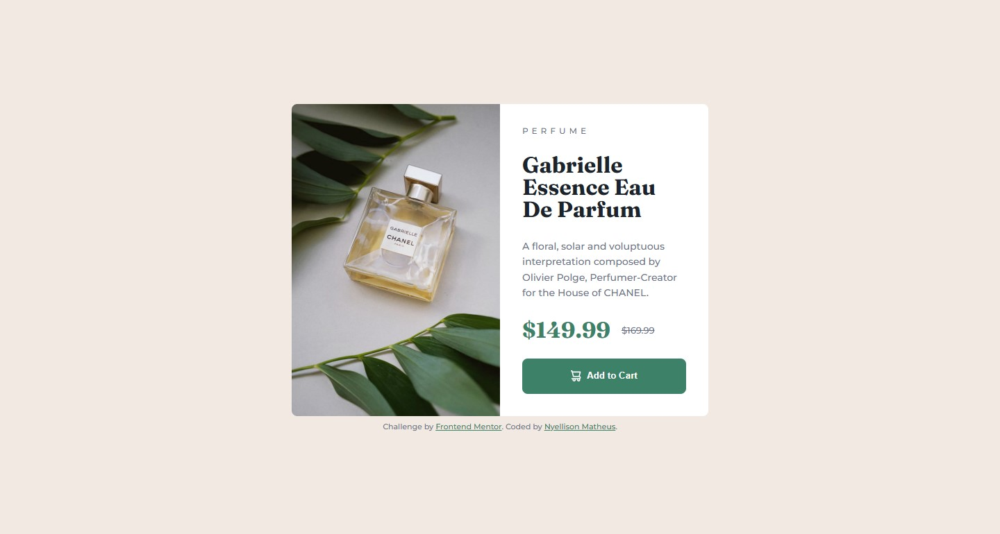

# Frontend Mentor - Solução de Card de Visualização de Produto (Product Preview Card)

Esta é a minha solução para o desafio "Product preview card component" do Frontend Mentor. O objetivo do projeto foi construir um card de visualização de produto totalmente responsivo, aproximando-se ao máximo do design original e praticando o fluxo mobile-first e o uso de imagens responsivas.

## Visão Geral

### O Desafio

Os usuários devem ser capazes de:
- Visualizar o layout ideal para a interface dependendo do tamanho da tela do seu dispositivo (responsividade completa).
- Ver estados de hover (passar o mouse) e foco em todos os elementos interativos da página.

### Captura de Tela



### Links

- **Código no GitHub:** [Visualizar Repositório](https://github.com/mnyellison/product-preview-card-component)
- **Site Online (Live Preview):** [Acessar Projeto](https://product-preview-card-component-three.vercel.app/)

---

## Meu Processo

### Tecnologias Utilizadas

- HTML5 Semântico
- Variáveis CSS (Custom Properties)
- Flexbox & CSS Grid
- Fluxo de desenvolvimento Mobile-first
- Imagens responsivas usando a tag `<picture>`

---

### O que eu aprendi neste projeto

Este projeto foi fundamental para consolidar boas práticas de layout e tratamento de mídia:

1. **Abordagem Mobile-First:** Estruturei todo o layout pensando primeiro nas telas menores, o que tornou a transição para desktop muito mais simples e limpa.
2. **Imagens Responsivas na Prática:** Implementei o elemento `<picture>` para alternar dinamicamente entre as imagens de celular e computador direto no HTML, economizando banda e melhorando a performance de carregamento.
3. **Tratamento Inteligente de Layout:** Utilizei `overflow: hidden` no container principal do card para cortar automaticamente as pontas da imagem do produto, evitando a necessidade de declarar `border-radius` repetitivos e redundantes nas media queries.

### Arquitetura do Projeto

Para garantir um ambiente limpo e organizado, separei as responsabilidades do projeto movendo os estilos para uma pasta dedicada:

```text
├── css/
│   └── style.css          # Estilos organizados com variáveis CSS e media queries
├── images/                # Todas as imagens e SVGs otimizados fornecidos pelo desafio
├── index.html             # Estrutura HTML5 limpa e semântica com implementação da tag <picture>
└── README.md              # Documentação do projeto e processo de aprendizado
```

### Próximos passos

Nos próximos projetos, pretendo continuar aprimorando:

- Workflows responsivos avançados utilizando layouts baseados em CSS Grid e Flexbox.
- Uso fluído de unidades relativas como `rem` e `em` para garantir melhor acessibilidade.
- Escrita de CSS escalável, equilibrando seletores semânticos e classes limpas.
- Organização e boas práticas no histórico de commits com Git.

---

### Recursos Úteis

- [MDN Web Docs - O Elemento Picture](https://developer.mozilla.org/en-US/docs/Web/HTML/Element/picture) - Me ajudou a validar a sintaxe correta para lidar com imagens responsivas no HTML.

---

### Colaboração com IA (Gemini)

Utilizei o Gemini durante o desenvolvimento deste projeto como um mentor técnico para:

- Auditar e refatorar meu CSS em busca de uma arquitetura mais limpa, removendo propriedades redundantes.
- Debater estratégias de arquitetura de código, analisando quando utilizar seletores globais de tags versus classes CSS dedicadas.
- Dominar o uso moderno da tag `<picture>` para entrega de imagens responsivas.
- Corrigir comportamentos de espaçamento estrutural com margens automáticas no Flexbox para evitar quebras de layout em telas muito pequenas.
- Planejar etapas lógicas de commits no Git.

O assistente me ajudou a raciocinar sobre decisões arquiteturais, garantindo que eu compreendesse o porquê de cada mudança em vez de apenas aplicar soluções prontas.

---

## Autor

- Frontend Mentor - [@mnyellison](https://www.frontendmentor.io/profile/mnyellison)
- GitHub - [@mnyellison](https://github.com/mnyellison)
